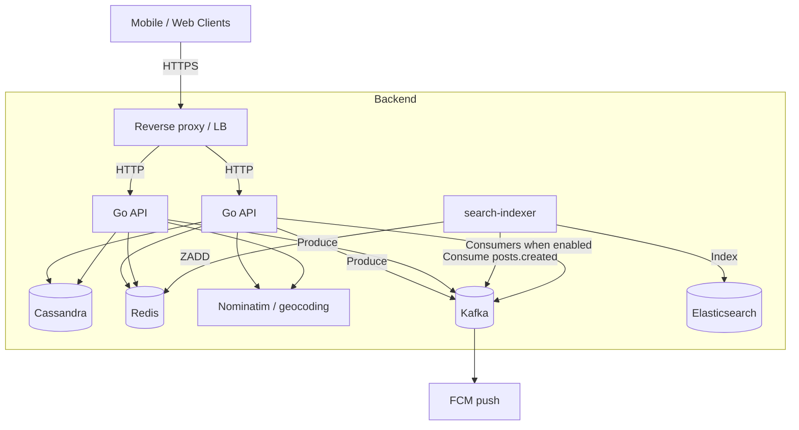

# Geoloc — Hyper-Local Social Media Backend

A high-performance geospatial social media backend built with **Go**, **Cassandra**, and **Redis**. Serves hyper-local feeds using geohashing, with optional **Kafka**, **Elasticsearch**, and **FCM** for search and notifications.

## Architecture



**Notes**

- **Cassandra** is the source of truth for posts, users, comments, devices, notifications.
- **Redis**: rate limits, like/comment counters, notification unread cache, SSE pub/sub, username autocomplete.
- **Elasticsearch**: full-text search; the API does **not** write ES directly — the **`search-indexer`** (`cmd/indexer`) consumes `posts.created` and `users.indexed`.
- With **`KAFKA_NOTIFICATIONS_ENABLED=true`**, the API process also runs **notification Kafka consumers** (persister, push, nearby fanout). For large scale, consider moving those to dedicated workers.

## Features

- **Geospatial posts**: Geohash-based proximity queries (`posts_by_geohash`).
- **Feed**: Cursor pagination, block/mute filtering, enriched posts (`like_count`, **`comment_count`**, `is_liked`, author, location).
- **Search**: ES-backed `/api/v1/search` and `/api/v1/search/nearby`; legacy Cassandra `/api/v1/search/posts`.
- **Notifications**: REST list + mark read; **SSE** (`/api/v1/notifications/stream` — also carries **DM** events on channel `dm:{userId}`); **FCM** when configured.
- **Direct messages (E2EE)**: REST + Redis/Kafka delivery; server stores ciphertext only — see [docs/api/dm.md](docs/api/dm.md).
- **Kafka**: Search events (`posts.created`), user index (`users.indexed`), notification pipeline when enabled.
- **Auth**: JWT (access + refresh), OAuth (Google/Apple), bcrypt passwords.
- **Moderation**: Block, mute, reports.

Full endpoint details: **[docs/api/](docs/api/README.md)** (preferred). Legacy monolith: [API_DOCUMENTATION.md](API_DOCUMENTATION.md).

## Tech stack

| Layer | Technology |
|-------|------------|
| API | Go (Gin) |
| Database | Apache Cassandra (gocql) |
| Cache / pub-sub | Redis |
| Search | Elasticsearch |
| Events | Kafka (segmentio/kafka-go) |
| Push | Firebase Cloud Messaging |
| Proxy (optional) | Caddy (see [Caddyfile](Caddyfile)) |

## Quick start

### Option A — Full stack in Docker (recommended for first run)

Compose services use **profiles**. To run API + indexer + infra:

```bash
docker compose --profile app up -d
```

Infrastructure only (run API locally with `go run cmd/api/main.go`):

```bash
docker compose --profile dev up -d
```

Then:

1. Ensure schema is applied (see [docs/deployment/docker.md](docs/deployment/docker.md) — `cassandra-db-init` or manual `cqlsh`).
2. API: [http://localhost:8080](http://localhost:8080) (container `geoloc-api`).
3. Health: `curl http://localhost:8080/health`

**TLS + Caddy** (optional):

```bash
docker compose --profile app --profile with-proxy up -d
```

### Option B — Local Go + Docker infra

```bash
docker compose --profile dev up -d
```

Copy env from [docs/environment.md](docs/environment.md). Minimum for search indexing:

- `KAFKA_BROKERS=127.0.0.1:9092` (use `127.0.0.1` on macOS Docker)
- `ELASTICSEARCH_URL=http://localhost:9200`

Then in separate terminals:

```bash
go run cmd/indexer/main.go          # required for new posts to appear in ES search
go run cmd/api/main.go
```

**One-off backfills** (when needed):

```bash
go run cmd/backfill-search/main.go           # historical posts → Elasticsearch
go run cmd/backfill-comment-counts/main.go # Cassandra comment_counts → Redis keys
```

## Environment variables

See **[docs/environment.md](docs/environment.md)** for the full list. Highlights:

| Variable | Role |
|----------|------|
| `CASSANDRA_HOST`, `CASSANDRA_PORT`, `CASSANDRA_KEYSPACE` | Database |
| `REDIS_HOST`, `REDIS_PORT` | Counters, SSE, rate limit |
| `JWT_SECRET` | **Required** — JWT signing |
| `KAFKA_BROKERS` | Enables `posts.created` / `users.indexed` producers on API |
| `KAFKA_NOTIFICATIONS_ENABLED` | Notification Kafka consumers + topics in API |
| `ELASTICSEARCH_URL`, `ELASTICSEARCH_INDEX_POSTS`, `ELASTICSEARCH_INDEX_USERS` | Search |
| `GIN_MODE=release`, `ALLOWED_ORIGINS`, `BASE_URL` | Production hardening |

## Documentation

| Doc | Content |
|-----|---------|
| [docs/api/](docs/api/README.md) | Per-domain API reference |
| [docs/environment.md](docs/environment.md) | Env vars |
| [docs/deployment/docker.md](docs/deployment/docker.md) | Compose profiles, services, backfills |
| [docs/deployment/production.md](docs/deployment/production.md) | Production checklist |
| [docs/architecture/overview.md](docs/architecture/overview.md) | System overview |
| [docs/client/](docs/client/) | Frontend integration notes |

## Development

### Format & build

```bash
gofmt -w .
go build -o /dev/null ./cmd/api
```

### Tests

```bash
go test ./...
```

Some packages expect Cassandra/Redis or have known test fixture issues; use targeted runs when needed:

```bash
go test ./internal/handlers ./internal/auth -count=1
```

## Project layout

```
cmd/
  api/                    # HTTP API
  indexer/                # Search indexer (Kafka → ES)
  backfill-search/        # ES backfill from Cassandra
  backfill-comment-counts/ # Redis comment_count warm-up
internal/
  handlers/               # HTTP handlers
  data/                   # Cassandra repositories
  notifications/          # Dispatcher, SSE, Kafka consumers
  search/                 # ES client, indexing events
  push/                   # FCM
docs/                     # Human-readable API & deployment docs
migrations/               # CQL schema
```

