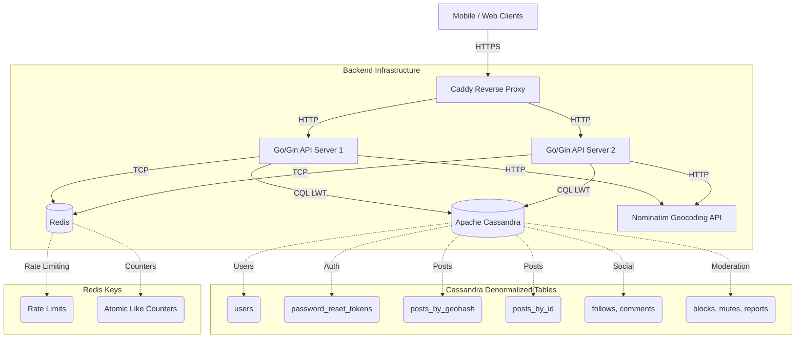

# Geoloc — Hyper-Local Social Media Backend

A high-performance geospatial social media backend built with **Go**, **Cassandra**, and **Redis**. Designed to serve hyper-local feeds based on proximity using geohashing techniques.

## 🏗 Architecture



## ✨ Features

- 🌍 **Geospatial Posts**: Store and query posts using Geohashing for fast proximity-based feeds.
- 📍 **Denormalized Feed**: High-performance feed retrieval from Cassandra `posts_by_geohash` tables.
- ⚡ **Highly Scalable**: Stateless Go API, horizontally scalable Cassandra cluster, and Redis atomic counters.
- 🔒 **Security First**: Bcrypt password hashing, JWT authentication (no default secrets), strict CORS, and brute-force protection.
- 🛡️ **Content Moderation**: Built-in user reporting, blocking, and muting system.
- 🗑️ **GDPR Compliant**: Full soft-deletion support with PII anonymization.
- 🚀 **Production Ready**: Multi-stage Dockerfile, CI/CD pipeline, and environment separation.

## 🛠 Tech Stack

- **Language**: Go 1.24+
- **Web Framework**: Gin
- **Database**: Apache Cassandra (gocql driver)
- **Cache & Rate Limiting**: Redis (go-redis)
- **Reverse Proxy**: Caddy (Auto Let's Encrypt TLS)
- **Authentication**: JWT & OAuth (Goth)

## 📚 API Documentation

All API endpoints, request/response formats, and authentication flows are documented in detail in the [API Documentation](API_DOCUMENTATION.md).

## 🚀 Quick Start

### 1. Start Infrastructure

The easiest way to run the application is using Docker Compose:

```bash
docker compose up -d
```

This starts:
- The Go API backend (`geoloc_api`)
- Caddy reverse proxy (`geoloc_caddy`)
- Apache Cassandra (`geoloc_cassandra`)
- Redis (`geoloc_redis`)

### 2. Apply Cassandra Migrations

Ensure the database schema is applied. If it's your first time, you might need to apply migrations manually or use a migration tool:

```bash
cqlsh -f migrations/cassandra_schema.cql
cqlsh -f migrations/003_mvp_features.cql
```

### 3. Access the API

The API will be available via Caddy on port `8080` (or `443` with TLS depending on your config).

Test the health endpoint:
```bash
curl http://localhost:8080/health
```

## ⚙️ Environment Variables

Copy `.env.development` to `.env` to configure your environment:

| Variable | Default | Description |
|----------|---------|-------------|
| `APP_ENV` | `development` | `development`, `staging`, or `production` |
| `CASSANDRA_HOSTS` | `localhost` | Comma-separated Cassandra hosts |
| `REDIS_HOST` | `localhost` | Redis host |
| `JWT_SECRET` | (required) | Secret key for signing JWTs |
| `ALLOWED_ORIGINS`| `http://localhost:3000` | CORS allowed origins |

## 🧪 Development

### Run Tests
The project includes a comprehensive E2E test suite utilizing Testcontainers:

```bash
go test ./...
```
