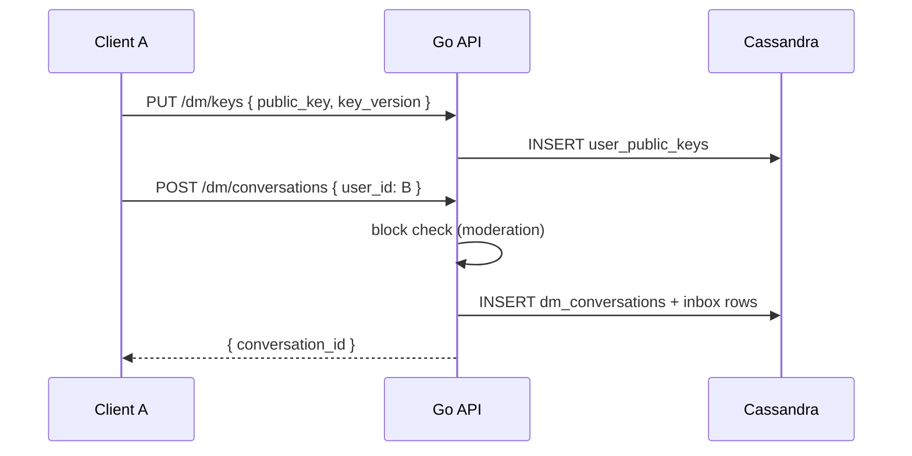
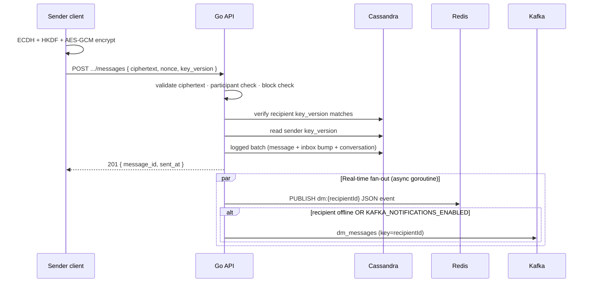

# Direct Messages (E2EE)

Architecture for end-to-end encrypted 1:1 direct messaging. The server is a **metadata and ciphertext relay** — it never sees private keys or plaintext.

**API reference:** [Direct messages API](../api/dm.md)

**Migrations:** `migrations/007_dm.cql`, `migrations/008_dm_multidevice.cql`

---

## Design goals

| Goal | Approach |
|------|----------|
| Confidentiality | Client-side X25519 + AES-256-GCM; server stores ciphertext only |
| Real-time delivery | Reuse notification SSE + Redis Pub/Sub |
| Offline delivery hook | Kafka topic `dm_messages` when recipient is not SSE-online |
| Multi-device | Versioned public keys + passphrase-wrapped identity backup |
| Message history | `sender_key_version` on each message; fetch historical keys by version |
| Moderation safety | Block checks before conversation create and send |

---

## Component map

```
┌─────────────────────────────────────────────────────────────────────┐
│                         Mobile / Flutter client                      │
│  DmCryptoService (X25519, HKDF, AES-GCM) — keys & plaintext local   │
└───────────────────────────────┬─────────────────────────────────────┘
                                │ HTTPS (JWT)
                                ▼
┌─────────────────────────────────────────────────────────────────────┐
│  internal/handlers/dm_handler.go                                     │
│  RegisterDMRoutes → keys, backup, conversations, messages, read     │
│  RateLimitByUser 60/min on writes · block checks via moderation     │
└───────────────┬─────────────────────────────┬───────────────────────┘
                │                             │
                ▼                             ▼
┌───────────────────────────┐   ┌─────────────────────────────────────┐
│ internal/data/            │   │ Real-time / async                    │
│ dm_repository.go          │   │  Redis Pub/Sub  channel dm:{userID}  │
│ Cassandra logged batch    │   │  SSE handler subscribes notif + dm   │
│ on send                   │   │  Kafka producer → topic dm_messages  │
└───────────────┬───────────┘   └─────────────────────────────────────┘
                │
                ▼
┌─────────────────────────────────────────────────────────────────────┐
│  Cassandra (geoloc keyspace)                                         │
│  user_public_keys · user_dm_identity_backups · dm_conversations      │
│  dm_conversations_by_user · dm_messages · dm_read_receipts           │
└─────────────────────────────────────────────────────────────────────┘
```

| Package / file | Role |
|----------------|------|
| `internal/handlers/dm_handler.go` | HTTP routes, validation, block checks, SSE/Kafka fan-out |
| `internal/data/dm_repository.go` | Cassandra persistence, conversation ID derivation, pagination |
| `internal/models/dm.go` | `DMMessage`, `DMConversation`, `PublicKeyRecord`, `DMIdentityBackup` |
| `internal/notifications/sse/handler.go` | Subscribes to `sse:user:{id}` and `dm:{id}`; sets `sse:online:{id}` |
| `internal/notifications/kafka/dm_producer.go` | Publishes to `dm_messages` (partition key = recipient id) |
| `cmd/api/main.go` | Wires `DMHandler`, `RegisterDMRoutes`, Kafka producer |

---

## Security model

### What the server stores

- X25519 **public** keys (`user_public_keys`), versioned
- Passphrase-wrapped identity backup blobs (`user_dm_identity_backups`) — opaque
- AES-GCM **ciphertext** + **nonce** per message
- Conversation membership, inbox rows, read receipts, soft-delete timestamps

### What never touches the server

- Private keys
- Plaintext message bodies
- Derived AES session keys (ECDH + HKDF output)

### Client crypto contract

1. Generate X25519 identity keypair locally.
2. `PUT /api/v1/dm/keys` — register public key with monotonic `key_version`.
3. Before send: `GET /api/v1/dm/keys/:peerId` → ECDH → **HKDF-SHA256** (`salt=geoloc-dm`, `info=dm-aes-key-v1`) → **AES-256-GCM**.
4. POST ciphertext, nonce, and **`key_version`** = recipient’s current version.

The API validates structure only: valid base64, nonce = 12 bytes decoded, ciphertext ≥ 17 bytes decoded.

---

## Conversation identity

1:1 conversations use a **deterministic UUID** so `GetOrCreate` is idempotent:

1. Sort participant UUIDs lexicographically → `(participant_a, participant_b)`.
2. Name string: `minUUID + "," + maxUUID`.
3. UUIDv5-style SHA-1 hash with fixed namespace `6f9619ff-8b86-d011-b42d-00cf4fc964ff`.

Implementation: `conversationIDForParticipants` in `internal/data/dm_repository.go`.

---

## Data flows

### A. Register keys and start chat



### B. Send message



**Send batch writes (single logged batch):**

- `dm_messages` — new row with `key_version`, `sender_key_version`
- `dm_conversations` — update `last_message_at`
- `dm_conversations_by_user` — upsert both participants’ inbox rows

### C. Real-time delivery (SSE)

The DM system **shares** the notification SSE connection — no separate WebSocket endpoint.

1. Client connects to `GET /api/v1/notifications/stream`.
2. Handler subscribes to Redis channels `sse:user:{id}` **and** `dm:{id}`.
3. Sets `sse:online:{id}` with 90s TTL; refreshed every 30s heartbeat.
4. On send, `publishRedisDM` publishes JSON to `dm:{recipientId}`.
5. SSE handler forwards the payload as an `data:` line.

Event types:

| `type` | Purpose |
|--------|---------|
| `dm_new_message` | New ciphertext; includes `key_version`, `sender_key_version` |
| `dm_read_receipt` | Peer read up to `last_read_id` |

### D. Kafka offline hook

Topic: **`dm_messages`**

Published when:

- `KAFKA_NOTIFICATIONS_ENABLED=true`, **or**
- Recipient has no `sse:online:{userID}` Redis key (offline)

Partition key = recipient user id. Payload mirrors SSE JSON. Intended for a future FCM/background consumer — not required for in-app SSE delivery.

Read receipts go to Kafka **only** when `KAFKA_NOTIFICATIONS_ENABLED=true`.

### E. Message history and pagination

- `GET /api/v1/dm/conversations/:id/messages?cursor=&limit=`
- Ordered newest-first (`message_id` TIMEUUID clustering DESC)
- Cursor = Cassandra page state (base64)
- Each row includes `key_version` and `sender_key_version` for client-side decryption of historical messages

### F. Multi-device and key rotation

| Concern | Mechanism |
|---------|-----------|
| New device restore | `PUT/GET /dm/keys/backup` — client-side passphrase wrap |
| Key rotation | New `key_version` via `PUT /dm/keys`; old versions retained |
| Decrypt old inbound | Use `sender_key_version` → `GET /dm/keys/:senderId?key_version=N` |
| List all peer keys | `GET /dm/keys/:userId/versions` |
| Own sent messages | Ciphertext encrypted for **recipient**; rely on local store or backup |

Migration `008_dm_multidevice.cql` adds `user_dm_identity_backups` and `sender_key_version` on `dm_messages`.

### G. Per-user inbox delete

`DELETE /api/v1/dm/conversations/:id` removes only the caller’s row from `dm_conversations_by_user`. Messages and the peer’s inbox are unchanged. Re-opening the chat via `POST /dm/conversations` restores the inbox row.

---

## Cassandra schema

See [Database schema — Direct messages](./database.md#direct-messages) for full DDL.

| Table | Query pattern |
|-------|---------------|
| `user_public_keys` | PK `(user_id, key_version DESC)` — current key = first row; all versions for history |
| `user_dm_identity_backups` | PK `(user_id, backup_version DESC)` — latest backup = first row |
| `dm_conversations` | PK `conversation_id` — canonical 1:1 metadata |
| `dm_conversations_by_user` | PK `(user_id, last_message_at DESC, conversation_id)` — inbox |
| `dm_messages` | PK `(conversation_id, message_id DESC)` — thread history |
| `dm_read_receipts` | PK `(conversation_id, user_id)` — per-user read cursor |

**Denormalization:** Inbox is a separate table keyed by user so listing conversations never scans all messages.

---

## Rate limiting and authorization

| Layer | Limit |
|-------|-------|
| Global IP | 100 req/min (1000/min in `APP_ENV=development`) |
| DM writes | 60 req/min per authenticated user (`RateLimitByUser`) |

All routes require JWT. Participant checks return **403** (not 404) for non-members — avoids leaking conversation existence.

Block integration: `IsBlocked` checked on conversation create and message send.

---

## Error handling highlights

| Scenario | HTTP | `error` |
|----------|------|---------|
| Recipient key stale | 409 | `key_version_mismatch` (+ `current_version`) |
| Sender has no key | 409 | `sender_has_no_public_key` |
| Peer never registered | 404 | `public_key_not_found` |
| Blocked relationship | 403 | `blocked` |
| Not in conversation | 403 | `forbidden` |

---

## Testing

| Test file | Coverage |
|-----------|----------|
| `internal/handlers/dm_handler_test.go` | HTTP validation, block/participant paths, key backup |
| `internal/data/dm_repository_test.go` | Conversation idempotency, send/list, backup, key versions (testcontainers + migrations 007/008) |

Run:

```bash
go test ./internal/handlers -run TestDMHandler
go test ./internal/data -run TestDMRepository
```

---

## Related documentation

- [Direct messages API](../api/dm.md) — endpoint reference and client flows
- [Notifications API](../api/notifications.md) — SSE stream and event types
- [Database schema](./database.md) — DM table definitions
- [System design](./system_design.md) — DM in the overall platform diagram
